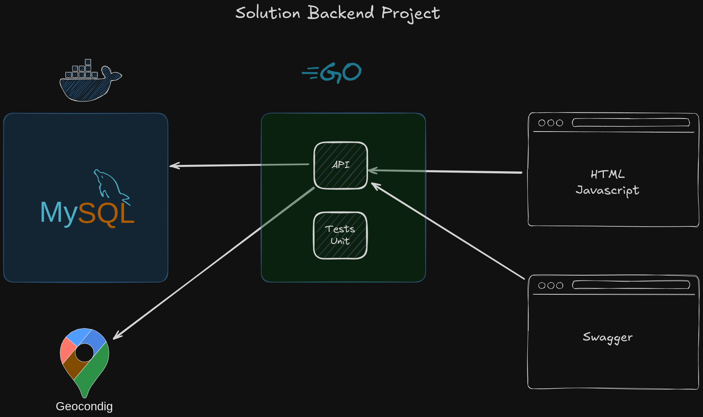
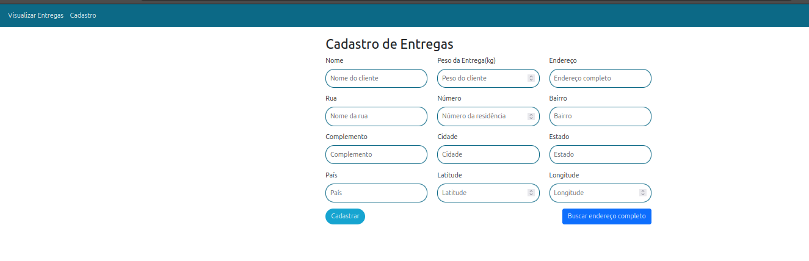
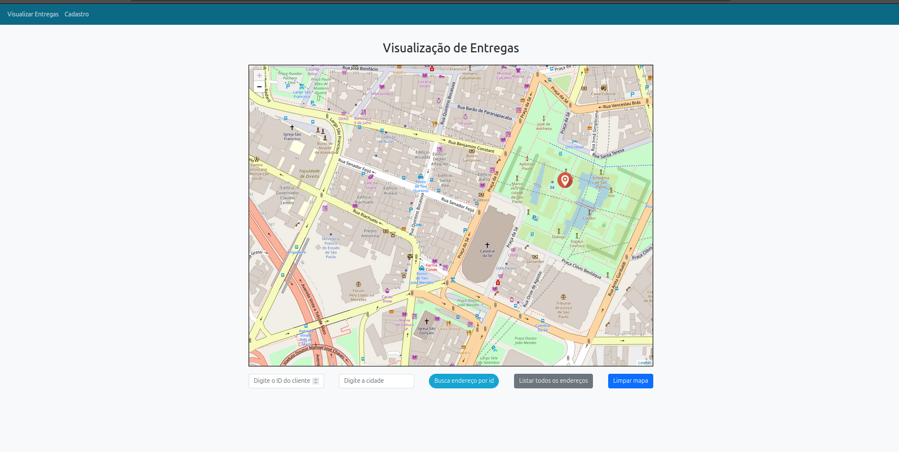
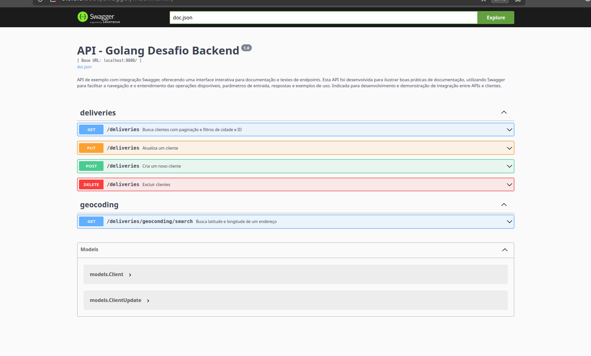

# Challenge para Desenvolvedor Back End - Api Golang
## Engenheiro Responsável
## Gabriel Andrade
# Projeto de Api com Golang, Mysql, Html e Javascript

Este projeto implementa uma API simples em Go, utilizando o GORM para interação com o banco de dados MySQL. A API permite criar e atualizar clientes, com auto testes configurados para garantir o bom funcionamento, alé das paginas de cadastro de clientes (usuarios com as funcionalidades de buscar os dados do endereço através de api de geocondig para buscar a localização de lat e long, afim de exibir no mapa) e o swagger com as instruções de uso das apis.



## Funcionalidades

### 1. **Validação de Campos Comuns de Cliente**

A função `ValidateCommonClientFields` valida os campos essenciais de um cliente. Ela verifica se todos os campos obrigatórios estão presentes e se os valores são válidos (por exemplo, se um campo numérico não é zero ou negativo). Caso algum campo esteja ausente ou inválido, a função retorna um erro e loga as informações de falha, como o nome do campo e o valor que causou o erro.

#### Campos Validados:
- **Name**: Não pode ser vazio.
- **TestTechnical**: Não pode ser vazio.
- **WeightKg**: Deve ser maior que 0.
- **Address**: Não pode ser vazio.
- **Street**: Não pode ser vazio.
- **Number**: Deve ser maior que 0.
- **Neighborhood**: Não pode ser vazio.
- **City**: Não pode ser vazio.
- **State**: Não pode ser vazio.
- **Country**: Não pode ser vazio.
- **Latitude**: Deve ser um valor válido (diferente de 0).
- **Longitude**: Deve ser um valor válido (diferente de 0).

### 2. **Criação de Cliente e Validação**

A função `CreateClientCheckValues` utiliza a função `ValidateCommonClientFields` para garantir que os dados do cliente estão corretos antes de prosseguir. Se a validação for bem-sucedida, ela retorna um mapa com um status de sucesso e uma mensagem.

**Status de Retorno:**
- `"status": "valid"`
- `"message": "Client validated successfully"`

### 3. **Validação de Atualização de Cliente**

A função `ValidateClientUpdate` é usada quando um cliente já existe e há a necessidade de atualizar seus dados. Ela valida se o ID do cliente está presente e é válido (maior que 0). Após essa validação, a atualização dos dados será realizada na persistência (banco de dados).

**Status de Retorno:**
- `"status": "valid"`
- `"message": "Client validated for update"`

Se o ID não for válido, retorna o erro:

```txt
"ID do cliente é obrigatório para atualização"
```

## Logs de Validação

Durante o processo de validação, os logs são utilizados para registrar falhas ou sucessos nas validações. O log será registrado com a severidade apropriada:

- **Logs de erro**: Caso algum campo esteja ausente ou com um valor inválido, um erro será logado com as informações detalhadas do campo problemático.
- **Logs de sucesso**: Caso a validação seja bem-sucedida, um log informando a conclusão bem-sucedida da validação será gerado.

### Exemplos de Log:

- **Erro**:  
  Caso o campo `Name` não seja preenchido, o log gerado será:

  ```txt
  Missing required field, field: name, value: 
  ```

- **Sucesso**:  
  Após a validação bem-sucedida de todos os campos, o log gerado será:

  ```txt
  Client validated successfully, field: validation, status: success
  ```

## Estrutura do Projeto

O projeto é composto por duas funções principais para a validação de dados de clientes:

1. **`ValidateCommonClientFields`**: Valida os campos essenciais de um cliente.
2. **`CreateClientCheckValues`**: Chama `ValidateCommonClientFields` e retorna um status de validação bem-sucedida.
3. **`ValidateClientUpdate`**: Valida a atualização dos dados de um cliente, verificando a existência de um ID válido.

Essas funções podem ser reutilizadas de forma flexível em diferentes partes do seu sistema para garantir a integridade dos dados de clientes, seja na criação ou atualização de informações.

## Como Utilizar

### Dependências

Este projeto foi desenvolvido com a linguagem Go e um container em docker do banco de dados Mysql. Certifique-se de ter o Go e o docker instalado em sua máquina.

## 1. Instalar o Go:  
   Se você ainda não tiver o Go instalado, siga as instruções em [https://golang.org/doc/install](https://golang.org/doc/install).

## 2. Instalar dependências:  
   Para instalar as dependências do seu projeto, navegue até o diretório do projeto e execute:

   ```bash
   go mod tidy
   ```
e o docker com o devido container


## 3. Configurar o Docker com o Docker Compose

Este projeto utiliza o Docker Compose para configurar e executar o banco de dados MySQL. Siga as instruções abaixo para configurar o container do MySQL.

### Passo 1: Instalar o Docker

Antes de começar a configurar o Docker Compose, você precisa ter o Docker instalado em seu sistema. O Docker permite a criação, o gerenciamento e a execução de containers, proporcionando um ambiente de desenvolvimento isolado.

#### Para sistemas **Linux** (Ubuntu):

1. Atualize o repositório de pacotes:
   ```bash
   sudo apt update
   ```

2. Instale pacotes necessários para permitir o uso de repositórios `https` e o repositório oficial do Docker:
   ```bash
   sudo apt install apt-transport-https ca-certificates curl software-properties-common
   ```

3. Baixe a chave oficial do Docker:
   ```bash
   curl -fsSL https://download.docker.com/linux/ubuntu/gpg | sudo apt-key add -
   ```

4. Adicione o repositório Docker ao APT sources:
   ```bash
   sudo add-apt-repository "deb [arch=amd64] https://download.docker.com/linux/ubuntu $(lsb_release -cs) stable"
   ```

5. Atualize novamente o repositório de pacotes:
   ```bash
   sudo apt update
   ```

6. Instale o Docker:
   ```bash
   sudo apt install docker-ce
   ```

7. Verifique se o Docker foi instalado corretamente:
   ```bash
   sudo docker --version
   ```

#### Para sistemas **Windows**:

1. Baixe o **Docker Desktop** no link [https://desktop.docker.com](https://desktop.docker.com).
2. Execute o instalador e siga os passos de instalação.
3. Após a instalação, inicie o Docker Desktop e verifique se o Docker está rodando corretamente no seu sistema.

#### Para sistemas **macOS**:

1. Baixe o **Docker Desktop** no link [https://desktop.docker.com](https://desktop.docker.com).
2. Abra o arquivo `.dmg` e siga as instruções para instalar o Docker Desktop.
3. Após a instalação, inicie o Docker Desktop e verifique se o Docker está funcionando corretamente.

---

### Passo 2: Instalar o Docker

Após criar o arquivo `docker-compose.yml`, o próximo passo é subir os containers definidos nele. No terminal, execute o comando:

```bash
docker-compose up -d
```

Esse comando vai iniciar o container MySQL em segundo plano (`-d` para detached). O Docker Compose vai baixar a imagem do MySQL (se necessário) e configurar o banco de dados conforme as variáveis de ambiente definidas no arquivo `docker-compose.yml`.

3. **Verificar se o MySQL está em execução**

Para verificar se o MySQL está rodando, use o seguinte comando:

```bash
docker ps
```

Isso irá listar todos os containers em execução. O container MySQL deve aparecer na lista.

4. **Conectar ao MySQL**

Agora que o MySQL está em funcionamento, você pode conectar-se ao banco de dados usando um cliente MySQL de sua preferência. Utilize as credenciais definidas no arquivo `docker-compose.yml`:

- **Host**: `localhost`
- **Porta**: `3306`
- **Usuário**: `golang`
- **Senha**: `golang`
- **Banco de Dados**: `golang`

Por exemplo, utilizando o cliente MySQL via terminal:

```bash
mysql -h localhost -u golang -p
```

Quando solicitado, insira a senha `golang`.

5. **Parar o Docker Compose**

Quando terminar de usar o ambiente Docker, pare os containers com o seguinte comando:

```bash
docker-compose down
```

Isso irá parar os containers e remover as redes e volumes criados durante a execução.

---

Com esses passos, você terá configurado o Docker, Docker Compose e o MySQL para o seu projeto. Isso permite um ambiente de desenvolvimento limpo, isolado e facilmente replicável por outros desenvolvedores.


### Execução do teste em Go

### 6. Executar os Testes

Execute os testes automatizados para garantir que tudo esteja funcionando corretamente:

```bash
go test ./tests -v
```

### Estrutura de Testes unitários

Os testes estão localizados na pasta `tests/`, e o arquivo `client_test.go` contém os testes para criação e atualização de clientes. Durante a execução dos testes, o seguinte processo ocorre:

1. **TestCreateClient**: Cria um cliente de teste e verifica se ele foi inserido corretamente.
2. **TestUpdateClient**: Atualiza o cliente criado e verifica se a atualização foi bem-sucedida.

### Saída Esperada:


```
=== RUN   TestCreateClient
2024/11/18 02:00:00 INFO Definindo nome da tabela para modelo Client table_name=clients
Conectado com sucesso ao MySQL!
2024/11/18 02:00:00 INFO Iniciando o processo de criação de cliente endpoint=CreateClient
2024/11/18 02:00:00 INFO Corpo da requisição lido com sucesso
2024/11/18 02:00:00 INFO Client validated successfully field=validation status=success
2024/11/18 02:00:00 INFO Iniciando o envio de resposta JSON endpoint=respondWithJSON
2024/11/18 02:00:00 INFO Resposta JSON enviada com sucesso
2024/11/18 02:00:00 INFO Cliente criado e resposta enviada com sucesso client_name="Teste Cliente"
--- PASS: TestCreateClient (0.03s)
=== RUN   TestUpdateClient
2024/11/18 02:00:00 INFO Definindo nome da tabela para modelo Client table_name=clients
Conectado com sucesso ao MySQL!
Cliente criado: {{331 2024-11-18 02:00:00.484 -0300 -03 2024-11-18 02:00:00.484 -0300 -03 <nil>} Cliente Teste 70 Rua Teste, 123  0 0 0}
2024/11/18 02:00:00 Cliente atualizado: {{331 2024-11-18 02:00:00.484 -0300 -03 2024-11-18 02:00:00.484 -0300 -03 <nil>} Cliente Atualizado 75 Rua Teste Atualizada, 456 0 0 0}
--- PASS: TestUpdateClient (0.05s)
```

### Pagina de cadastro com a busca de lat e long por meio de endereço completo

Nessa pagina podemos inserir o usuario temos a funcionalidade que usa uma api externa para retornar com esses dados e após inserir, também existe a pagina com o mapa embutido onde é possivel filtrar o endereço pelo id ou cidade nos campos inferiores, ao clicar os campos são limpos automaticamente.



Mapa com as buscas e os dados exibidos por pin 



### Swagger

Nesse projeto também foi possivel a confecção do swagger com a explicação de cada rota e seus testes de uso na pratica, facilitando assim os clientes de backend para a sua utilização.





### Requisitos obrigatórios que não foram entregues.

Para esse projeto foi necessário o uso de uma api de geolocalização tanto para a comum onde inserimos o endereço completo e retornamos com o lat e long e outras partes como estado, pais e outros, não utilizei o Google Maps geoconding por conta de não mais ter mais créditos no GCP nos meus emails de utlização, 

Tentei buscar outras similares como [https://locationiq.com/](https://locationiq.com/) mas sem sucesso por conta de não retornar um ponto preciso para tal uso, sendo assim seguindo com a [https://distancematrix.ai/pt](https://distancematrix.ai/pt) que entrega com mais precisão proxima do google maps.

Sendo assim não foi possivel entregar apenas a função de Geoconding Reverse, mas tenho entendimento de como ser feito.

## Contribuição

Se você deseja contribuir com o projeto, fique à vontade para enviar pull requests. Certifique-se de que o código esteja bem testado e com a formatação correta. Para contribuir, siga estas etapas:

1. Faça um fork do repositório.
2. Crie uma nova branch para a sua funcionalidade.
3. Faça as alterações necessárias.
4. Envie um pull request com uma descrição clara das mudanças.
